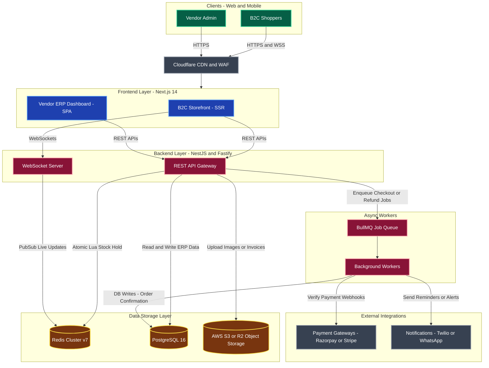

# FlashERP System Architecture

This document visualizes the "Enterprise Event-Driven Stack" designed for FlashERP's B2C single-vendor model. It handles high-concurrency flash sales, atomic reservations, and real-time updates.

## System Architecture Diagram

## Core Components Breakdown

1. **Frontend Layer (Next.js)**: 
   - **Storefront**: Utilizes Server-Side Rendering (SSR) for instant first contentful paint and SEO (crucial for sharing deal links). Connects to WebSockets for live countdown timers and stock drops.
   - **Vendor ERP**: A client-side Single Page Application (SPA) nested inside the Next.js app, offering a fast, app-like experience for warehouse and finance managers.

2. **Backend API (NestJS + Fastify)**: 
   - The modular core containing domains like Inventory, Orders, and Finance. Fastify ensures ultra-high throughput during the first minutes of a flash deal.

3. **In-Memory Engine (Redis)**: 
   - Uses atomic Lua scripts to manage the 10-minute cart reservations (hard stock holds) and prevents overselling without crashing the primary database with locks.

4. **Async Workers (BullMQ)**: 
   - Buffers the massive influx of checkout requests. Instead of 10,000 direct database writes per second, BullMQ throttles and processes orders reliably in the background.

5. **Primary Database (PostgreSQL)**: 
   - Maintains strict ACID compliance for financial ledgers, completed orders, purchase orders (POs), and GST tax calculations.
