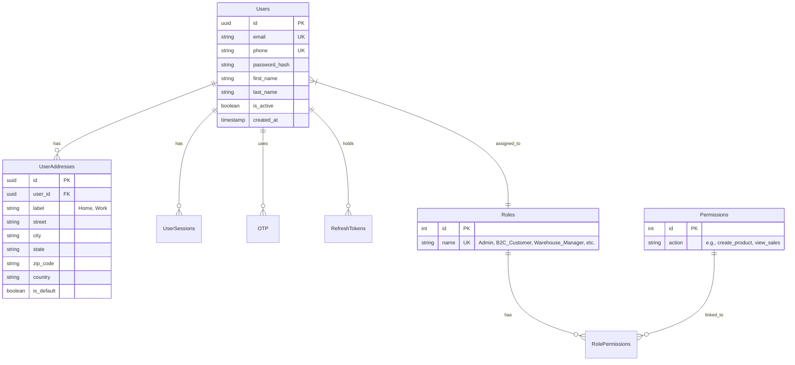
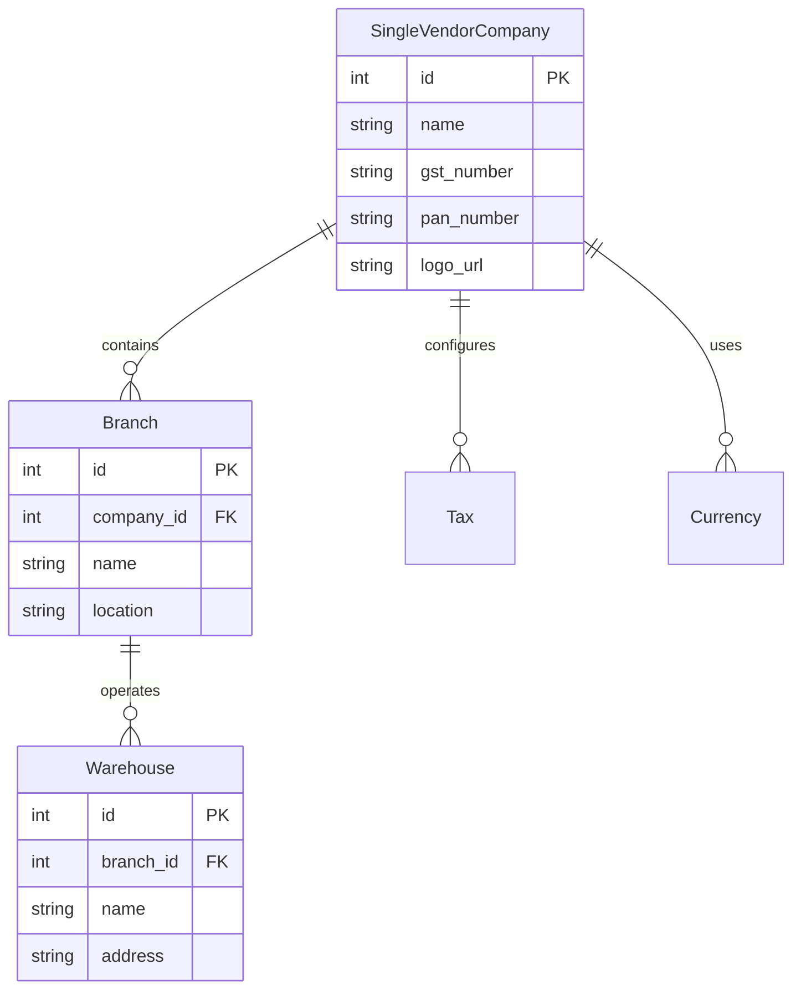
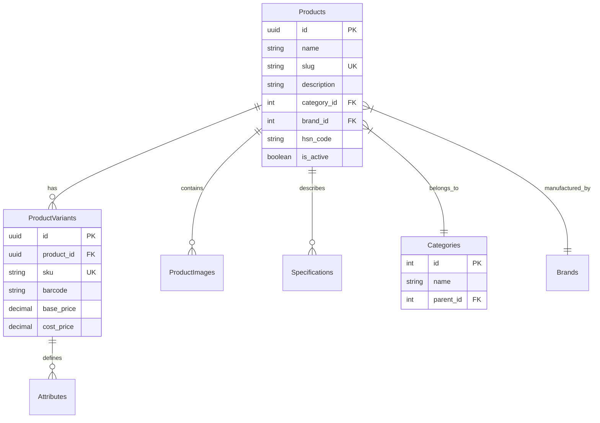
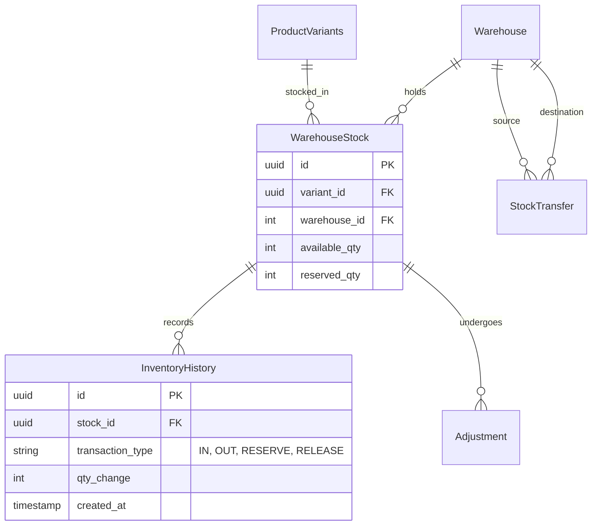
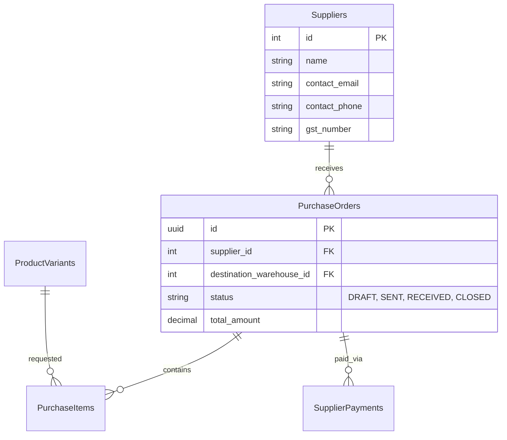
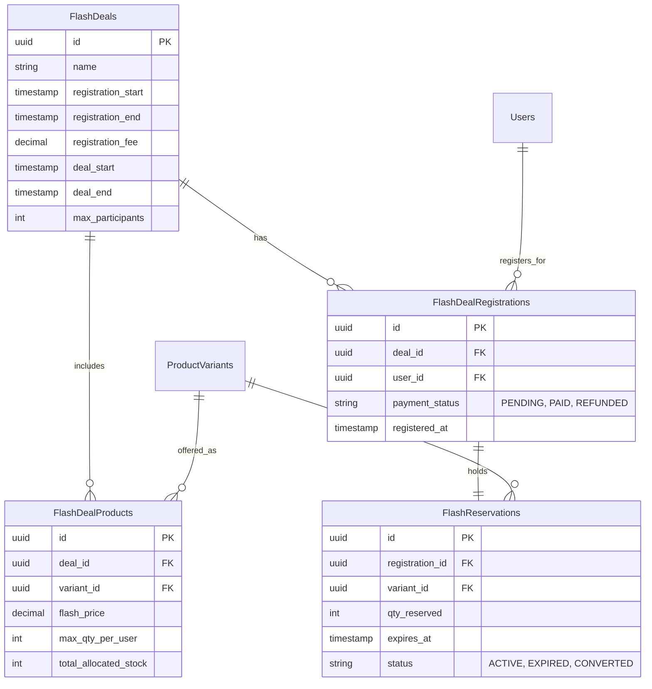
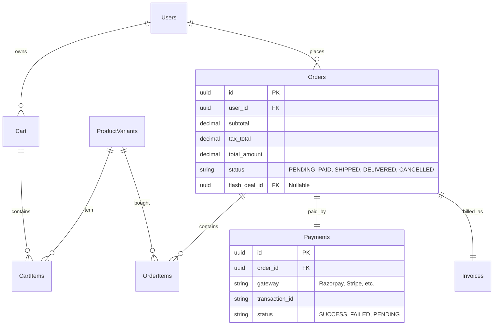
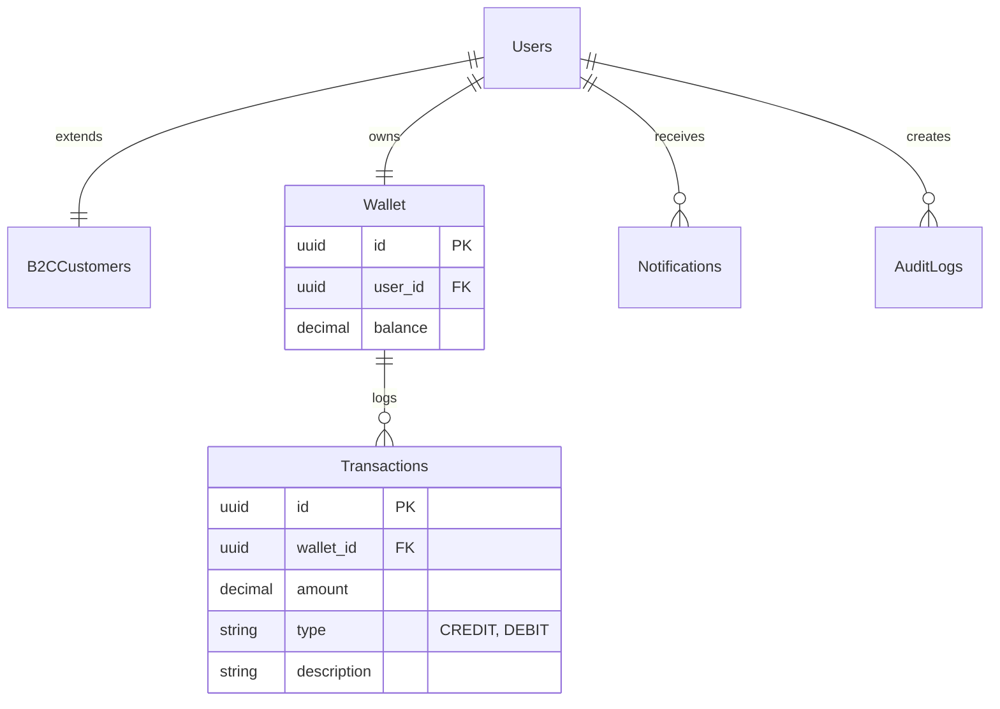

# FlashERP Database Schema Design

This document details the relational database schema designed for the FlashERP system, as specified in the `FlashERP_PRD.md`. It uses PostgreSQL as the primary database.

The schema is divided into logical domains to better understand the relationships.

## 1. Core Authentication & Authorization

## 2. Company & Organizational Settings

## 3. Product Catalog

## 4. Inventory Management

## 5. Supplier & Purchasing

## 6. Flash Deals Engine

## 7. B2C Orders & Checkout

## 8. Customer CRM, Wallet & Utility

## Key Architectural Notes

1. **Atomic Inventory Control:** 
   The `WarehouseStock` entity splits `available_qty` and `reserved_qty`. When a flash deal item is added to the cart, the Redis reservation engine atomically increments `reserved_qty` and decrements `available_qty` to prevent database-level locks and overselling.
   
2. **Flash Deal Participation:** 
   Only users with a `PAID` `FlashDealRegistrations` record are allowed to create `FlashReservations` during the deal window. 

3. **Single Vendor Context:**
   Unlike multi-vendor schemas, `Products` and `Inventory` are tied globally to the `SingleVendorCompany` rather than having multiple merchant IDs. `Suppliers` act as sources for goods (B2B purchasing), and `Users` with `B2C_Customer` role represent the end consumers.
